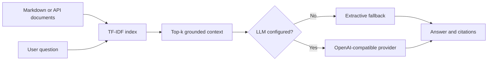

# RAG Knowledge API

[](https://github.com/ashfakmohamed/rag-knowledge-api/actions/workflows/ci.yml)

A production-minded FastAPI reference project for **retrieval-augmented generation with grounded citations**. It runs locally without API keys and can optionally connect to any OpenAI-compatible generation endpoint.

## Why this project

The repository demonstrates the boundaries that matter in a maintainable RAG service:

- validated ingestion and query APIs
- deterministic TF-IDF retrieval for reproducible tests
- explicit source citations and relevance scores
- a secret-free extractive fallback
- an optional provider-compatible generation adapter
- retrieval evaluation in CI
- Docker deployment with a non-root runtime user

## Architecture



## Run locally

```bash
python -m venv .venv
.venv\\Scripts\\activate
pip install -r requirements-dev.txt
uvicorn app.main:app --reload
```

Open `http://127.0.0.1:8000/docs` for the interactive API documentation.

## Query example

```bash
curl -X POST http://127.0.0.1:8000/query \
  -H "Content-Type: application/json" \
  -d '{"question":"How is the portfolio deployed?","top_k":2}'
```

The response includes the grounded answer, document IDs, source paths, excerpts, and retrieval scores.

## Add a document

```bash
curl -X POST http://127.0.0.1:8000/documents \
  -H "Content-Type: application/json" \
  -d '{"title":"Runbook","content":"The service deploys through GitHub Actions.","source":"runbook.md"}'
```

## Optional generation provider

Set `LLM_BASE_URL`, `LLM_API_KEY`, and `LLM_MODEL` using `.env.example` as a reference. If any value is absent, the service remains in deterministic retrieval-only mode. Secrets are never required for tests.

## Quality checks

```bash
ruff check .
pytest -q
python -m scripts.evaluate
```

The included evaluation asserts `recall@1` for known questions. Production extensions could replace TF-IDF with ChromaDB or pgvector and add larger grounded-answer evaluation datasets.

## API endpoints

| Method | Endpoint | Purpose |
| --- | --- | --- |
| `GET` | `/health` | Service and document-index status |
| `POST` | `/documents` | Add a document to the in-memory index |
| `POST` | `/query` | Retrieve context and return a grounded answer |

## Security notes

- Query and document sizes are validated.
- Generation credentials are environment-only.
- CI requires no external model or secret.
- The container runs as an unprivileged user.
- Retrieved evidence is returned with every grounded answer.
